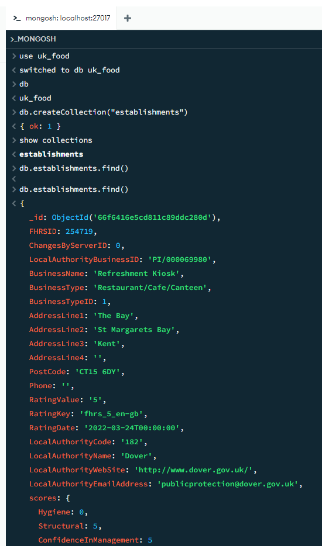
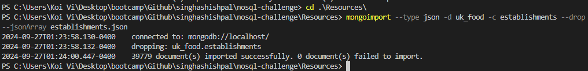

# nosql-challenge
This is a repo for nosql-challenge.


Terminal Commands:

```
PS C:\Users\Koi Vi\Desktop\bootcamp\Github\singhashishpal\nosql-challenge> cd .\Resources\
PS C:\Users\Koi Vi\Desktop\bootcamp\Github\singhashishpal\nosql-challenge\Resources> mongoimport --type json -d uk_food -c establishments --drop --jsonArray establishments.json
2024-09-27T01:23:58.130-0400    connected to: mongodb://localhost/
2024-09-27T01:23:58.132-0400    dropping: uk_food.establishments
2024-09-27T01:24:00.447-0400    39779 document(s) imported successfully. 0 document(s) failed to import.
PS C:\Users\Koi Vi\Desktop\bootcamp\Github\singhashishpal\nosql-challenge\Resources
```




